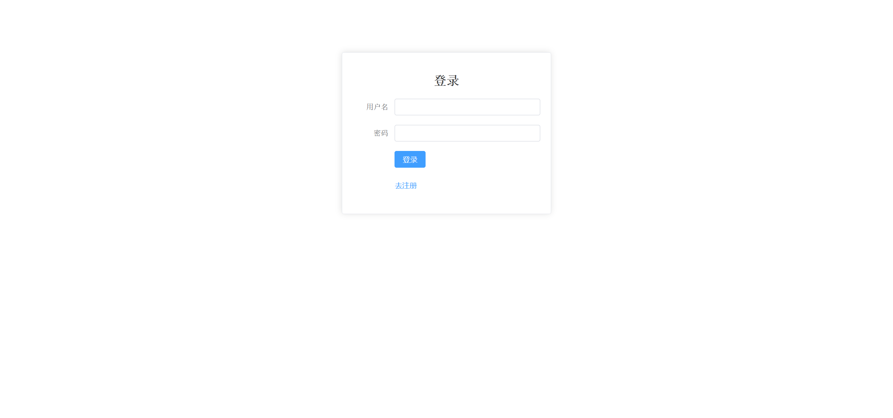
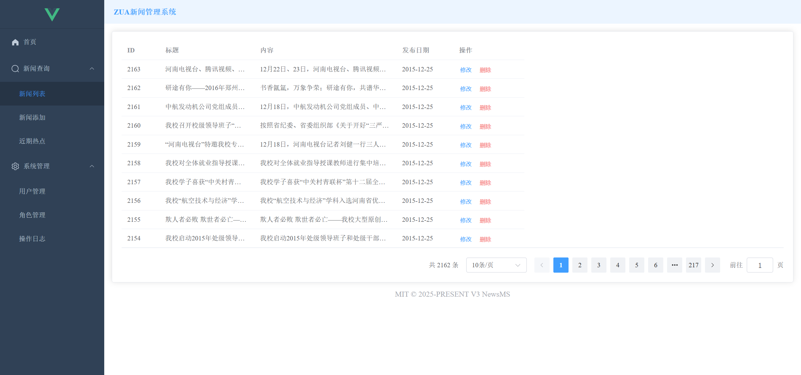
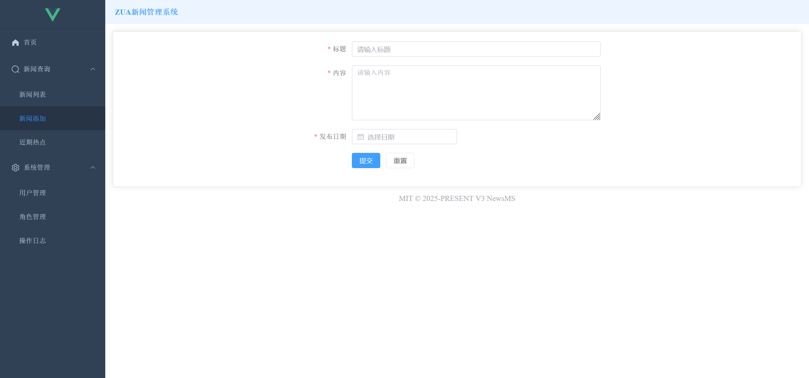

# ZUA NEWS - 郑航新闻后台管理系统

基于 Spring Boot 3 + Vue 3 的新闻后台管理系统，包含新闻数据的爬取、管理与展示功能。  
前端脚手架参考：[v3-admin-vite](https://github.com/un-pany/v3-admin-vite)  。

## 技术栈

**后端**
- Spring Boot 3.5.0 / Java 21
- MyBatis-Plus 3.5.12 + 分页插件
- MySQL 8 + Druid 连接池
- JWT (jjwt 0.12.6) 鉴权

**前端**
- Vue 3.5 + TypeScript
- Vite 6
- Element Plus 2.10
- Vue Router 4 + Pinia 3
- Axios

## 项目结构

```
demo/
├── src/main/java/com/example/xfk/
│   ├── common/                    # 公共模块
│   │   ├── config/                #   配置类（CORS、MyBatis-Plus 等）
│   │   ├── constant/              #   常量定义
│   │   ├── exception/             #   全局异常处理
│   │   ├── interceptor/           #   鉴权拦截器
│   │   ├── result/                #   统一响应封装
│   │   └── utils/                 #   工具类（JwtUtil 等）
│   ├── controller/                # 控制器
│   ├── entity/                    # 实体类
│   │   ├── dto/                   #   数据传输对象
│   │   └── vo/                    #   视图对象
│   ├── mapper/                    # MyBatis Mapper
│   └── service/                   # 服务层
│       └── impl/                  #   服务实现
├── vue-front/                     # 前端项目
│   └── src/
│       ├── common/                #   通用模块（axios 封装等）
│       ├── layouts/               #   布局组件
│       ├── pages/                 #   页面组件
│       ├── pinia/                 #   状态管理
│       └── router/                #   路由配置
└── img/                           # 截图资源
```

## 功能展示

**登录注册**


**新闻列表 - 支持删除和修改**


**添加新闻**


## 快速开始

### 1. 准备数据库

创建 MySQL 数据库 `shixi`，然后修改 `src/main/resources/application.yaml` 中的数据库连接信息：

```yaml
spring:
  datasource:
    url: jdbc:mysql://localhost:3306/shixi?serverTimezone=UTC&useSSL=false&useUnicode=true&charsetEncoding=UTF-8
    username: root
    password: your_password
```

### 2. 爬取新闻数据

运行以下 Python 脚本，从郑航新闻网爬取数据并导入数据库：

```py
import requests
import re
import pymysql
from lxml import etree
from bs4 import BeautifulSoup
from datetime import datetime


class NewsSpider:
    def __init__(self):
        self.url = 'https://news.zua.edu.cn/xwtt1.htm'
        self.headers = {
            'User-Agent': 'Mozilla/5.0 (Windows NT 10.0; Win64; x64) AppleWebKit/537.36 (KHTML, like Gecko) Chrome/119.0.0.0 Safari/537.36'
        }
        self.total_pages = 1
        self.seen_titles = set()

        self.db_config = {
            'host': 'localhost',
            'user': 'root',
            'password': '',
            'database': '',
            'charset': 'utf8mb4'
        }

        self.conn = None
        self.cursor = None

    def clean_text(self, text):
        """清理文本中的特殊字符和空白"""
        if not text:
            return ''
        text = text.replace('\u200b', '').replace('\n', ' ').strip()
        return ' '.join(text.split())

    def connect_db(self):
        """连接MySQL数据库"""
        try:
            self.conn = pymysql.connect(**self.db_config)
            self.cursor = self.conn.cursor()
            print("成功连接到MySQL数据库")
        except pymysql.Error as e:
            print(f"数据库连接失败: {e}")
            raise

    def close_db(self):
        """关闭数据库连接"""
        if self.cursor:
            self.cursor.close()
        if self.conn:
            self.conn.close()
        print("数据库连接已关闭")

    def create_table(self):
        """创建新闻表"""
        sql = """
        CREATE TABLE IF NOT EXISTS news (
            id INT AUTO_INCREMENT PRIMARY KEY,
            title VARCHAR(255) NOT NULL,
            content TEXT,
            publish_date DATE,
            created_at TIMESTAMP DEFAULT CURRENT_TIMESTAMP,
            UNIQUE KEY (title)
        ) ENGINE=InnoDB DEFAULT CHARSET=utf8mb4 COLLATE=utf8mb4_unicode_ci
        """
        try:
            self.cursor.execute(sql)
            self.conn.commit()
            print("新闻表创建成功或已存在")
        except pymysql.Error as e:
            print(f"创建表失败: {e}")
            self.conn.rollback()
            raise

    def insert_news(self, title, content, publish_date):
        """插入新闻数据到数据库"""
        sql = """
        INSERT INTO news (title, content, publish_date)
        VALUES (%s, %s, %s)
        ON DUPLICATE KEY UPDATE content=VALUES(content), publish_date=VALUES(publish_date)
        """
        try:
            self.cursor.execute(sql, (title, content, publish_date))
            self.conn.commit()
            return True
        except pymysql.Error as e:
            print(f"插入数据失败: {e}")
            self.conn.rollback()
            return False

    def get_total_pages(self, html):
        page_info = html.xpath('//*[@id="fanye126103"]/text()')
        if page_info:
            match = re.search(r"(\d+)/(\d+)", page_info[0])
            if match:
                return int(match.group(2))
        return 1

    def parse_news_page(self, html_content):
        soup = BeautifulSoup(html_content, 'html.parser')
        news_items = soup.find_all('li', class_='clearfix')
        news_data = []

        for item in news_items:
            title = self.clean_text(item.find('a').text)
            if title in self.seen_titles:
                continue

            self.seen_titles.add(title)
            content = self.clean_text(item.find('p').text)
            date_str = self.clean_text(item.find('div', class_='time').text)

            try:
                publish_date = datetime.strptime(date_str, '%Y.%m.%d').date()
            except ValueError:
                publish_date = None

            news_data.append((title, content, publish_date))

        return news_data

    def fetch_page(self, url):
        try:
            response = requests.get(url, headers=self.headers)
            response.encoding = response.apparent_encoding
            response.raise_for_status()
            return response.text
        except requests.RequestException as e:
            print(f"请求页面失败: {e}")
            return None

    def run(self):
        try:
            self.connect_db()
            self.create_table()

            print("开始爬取首页...")
            html_content = self.fetch_page(self.url)
            if not html_content:
                return

            html = etree.HTML(html_content)
            self.total_pages = self.get_total_pages(html)

            news_data = self.parse_news_page(html_content)
            for title, content, publish_date in news_data:
                self.insert_news(title, content, publish_date)

            for page in range(1, self.total_pages):
                page_url = f'https://news.zua.edu.cn/xwtt1/{self.total_pages - page}.htm'
                print(f"正在爬取第 {page + 1} 页: {page_url}")

                page_content = self.fetch_page(page_url)
                if not page_content:
                    continue

                news_data = self.parse_news_page(page_content)
                for title, content, publish_date in news_data:
                    self.insert_news(title, content, publish_date)

            print("爬取完成！")

        except Exception as e:
            print(f"运行过程中发生错误: {e}")
        finally:
            self.close_db()


if __name__ == '__main__':
    spider = NewsSpider()
    spider.run()
```

### 3. 启动后端

```sh
./mvnw spring-boot:run
```

后端默认运行在 `http://localhost:8080`  
注意端口冲突，后台steam占用的也是8080端口，修改端口号/退出steam 。     

### 4. 启动前端

```sh
cd vue-front
pnpm install
pnpm dev
```

## 接口说明

| 方法   | 路径              | 说明     | 鉴权 |
|--------|-------------------|----------|------|
| POST   | /api/login        | 用户登录 | 否   |
| POST   | /api/register     | 用户注册 | 否   |
| GET    | /api/news/list    | 新闻列表 | 是   |
| POST   | /api/news/add     | 添加新闻 | 是   |
| PUT    | /api/news/update  | 修改新闻 | 是   |
| DELETE | /api/news/delete  | 删除新闻 | 是   |

所有鉴权接口需在请求头携带 `Authorization: Bearer <token>`。


## 借助 IEEA Qoder 辅助实现  

主要问答:  
1.你阅读整个项目理解下，并将项目按照config,controller,entity,entity下dto,vo;service,service下impl的项目结构，优化项目代码规范，不需要的目录只创建就行，不要硬写。    
2.你觉得这个新闻后台管理系统common目录，还应该写些什么模块，不用给代码。    
根据项目当前技术栈（Spring Boot 3 + MyBatis-Plus + 前后端分离），`common` 目录通常会包含以下模块：
回答:
### `common` 目录预期模块

**config（配置）**
- `MybatisPlusConfig` — 已有，分页插件
- `CorsConfig` — 跨域全局配置（替代每个 Controller 上的 `@CrossOrigin`）
- `WebMvcConfig` — 拦截器注册、静态资源映射等

**result（统一响应）**
- `Result<T>` — 统一返回体封装，包含 code、message、data
- `ResultCode` — 状态码枚举（如 200成功、401未登录、403无权限、500错误）

**exception（全局异常处理）**
- `GlobalExceptionHandler` — `@RestControllerAdvice` 捕获全局异常
- `BusinessException` — 自定义业务异常类

**utils（工具类）**
- `JwtUtil` — JWT 生成与解析（登录 Token）
- `PasswordUtil` — 密码加密工具（如 BCrypt）
- `PageUtil` — 分页参数封装工具

**interceptor（拦截器）**
- `AuthInterceptor` — Token 校验拦截器，保护需要登录的接口

**constant（常量）**
- `SystemConstant` — 系统级常量（如 Token 前缀、过期时间等）

---

### 优先级建议

| 优先级 | 模块 | 原因 |
|---|---|---|
| 高 | `result` 统一响应 | 当前接口返回裸 String/boolean，不规范 |
| 高 | `exception` 全局异常 | 无异常兜底，出错直接 500 |
| 中 | `interceptor` + `JwtUtil` | 登录接口无 Token 鉴权，任何人可访问 |
| 低 | `constant`、`utils` | 随业务发展逐步积累 |  
---
3.我测试了下后端接口，感觉没问题，但前端有很多问题，我将前端代码放到的vue-front下，先理解分析。D:\springboot\demo\vue-front，就在该项目demo下。   
回答:
## 前端问题分析

### 问题一：接口响应格式已变更，前端判断逻辑失效（严重）

后端重构后所有接口返回 `Result<T>` 统一格式：
```json
{ "code": 200, "message": "操作成功", "data": "eyJhbGc..." }
```


但前端还在用旧的字符串判断：

**login/index.vue**
```ts
// 旧：判断字符串
if (res.data === 'Login successful')

// 应改为
if (res.data.code === 200)
// 并从 res.data.data 取 token 存储
```


**register/index.vue**
```ts
// 旧
if (res.data === 'Register successful')

// 应改为
if (res.data.code === 200)
```


**newsinfo/index.vue**
```ts
// 旧：直接取 data
newsList.value = response.data.data
pagination.value.total = response.data.total

// 应改为（多了一层 data 包裹）
newsList.value = response.data.data.data
pagination.value.total = response.data.data.total
```


---

### 问题二：登录后无 Token 存储与携带（严重）

登录成功后后端返回 JWT Token，但前端：
- 没有保存 Token（`pinia/stores/user.ts` 是空文件）
- 后续所有请求没有携带 `Authorization` 头
- `AuthInterceptor` 会拦截所有 `/api/news/**` 请求返回 401

---

### 问题三：路由没有登录守卫（严重）

未登录可以直接访问 `/dashboard`、`/demo/news` 等页面，无鉴权保护。

---

### 问题四：路由配置冲突

```ts
// 两个 path: '/' 的路由，第二个会被忽略
{ path: '/', redirect: '/login' }
{ path: '/', component: Layout, redirect: '/dashboard' }
```


---

### 问题五：axios 硬编码地址，无统一请求封装

所有请求都直接写 `http://localhost:8080`，无统一拦截器处理 token 注入和错误响应。

---

### 问题六：`.env` 配置的路由模式与代码不一致

`.env` 配置 `VITE_ROUTER_HISTORY = hash`，但 `router/index.ts` 使用的是 `createWebHistory()`（HTML5 模式），配置没有被实际读取。

---

## 问题汇总

| # | 位置 | 问题 | 严重程度 |
|---|---|---|---|
| 1 | login/register | 响应格式判断失效 | 高 |
| 2 | 全局 | 无 Token 存储与携带 | 高 |
| 3 | router | 无路由登录守卫 | 高 |
| 4 | router | 两个 `path:'/'` 冲突 | 中 |
| 5 | 所有页面 | axios 无封装，无拦截器 | 中 |
| 6 | .env / router | 路由模式配置未生效 | 低 |

---

需要我逐个修复吗？还是按优先级一次性全部修复？    

4.Solve the error:  
```
com.example.xfk.common.exception.BusinessException: 未登录或登录已过期
```
回答:  
**问题原因：**

从堆栈信息可以看出，触发异常的请求是 `doOptions`（即浏览器发送的 **CORS 预检请求 OPTIONS**）。

浏览器在跨域请求前会先发一个 `OPTIONS` 预检请求，这个请求不携带 `Authorization` Token，所以被 `AuthInterceptor` 拦截并抛出了"未登录"异常。

虽然 `addCorsMappings` 里配置了 `OPTIONS` 方法允许，但拦截器在 CORS 处理之前执行，导致预检请求被拦截。

**解决方案：** 在拦截器中放行 `OPTIONS` 请求：

AuthInterceptor.java

**修改说明：**

在preHandle方法最开头添加了对 `OPTIONS` 请求的放行判断。浏览器的 CORS 预检请求（`OPTIONS`）不会携带 Token，因此需要直接返回 `true` 放行，让 Spring 的 CORS 配置接管处理，后续的真实请求（`GET`/`POST` 等）依然会走 Token 校验逻辑。